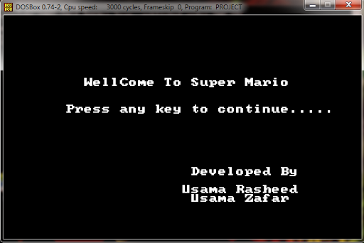
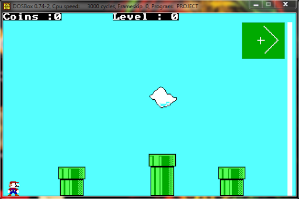
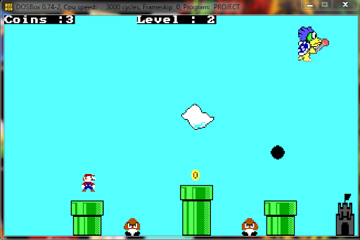
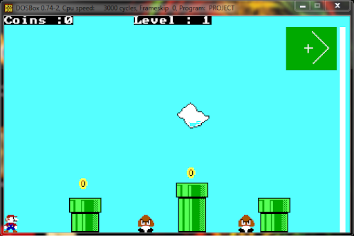
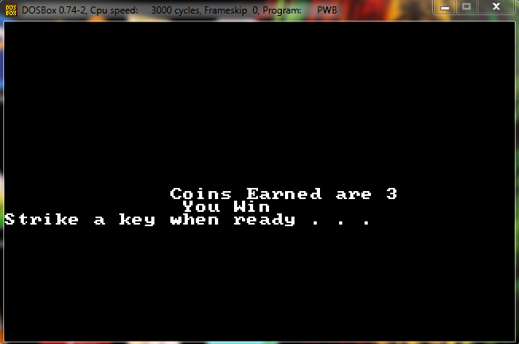

# 3-leveled-Super-Mario-Game
I have displayed the obstacles and flag and Mario, Enemy, Castle, Coin and dragon. I have used the concept of arrays in our project in which we have stored the colour of pixels in arrays and printed those pixels using a 2-d Array. For left and right movement, we are using the LEFT, RIGHT UP and Down keys for the movement of the Mario. I have used the interrupt 13h with screen resolution of 320x200.

##  Screens
-	Starting Screen: A well-crafted screen with a super Mario Welcome screen and Name of the developers.
-	Transition Screens : A screen used to signal the completion of a level
-	Ending Screens: Two screens which show if the player has won the game or lost it.

## Extra Features
-	Transition Screen
-	Score Count (fully implemented)
-	Stages Count (fully implemented)

## Start Screen

## Level 1 Screen

## Level 2 Screen

## Level 3 Screen

## Ending Screen

